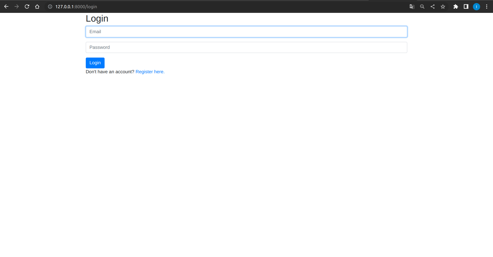
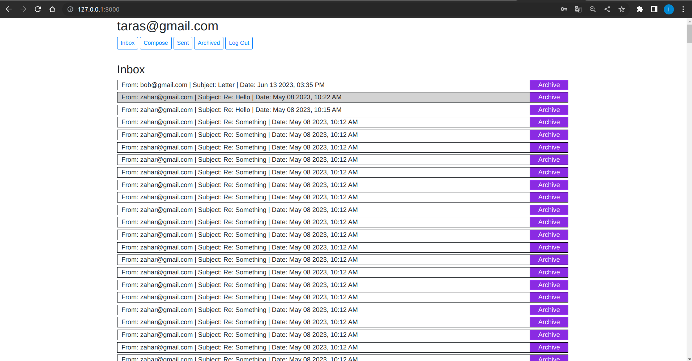
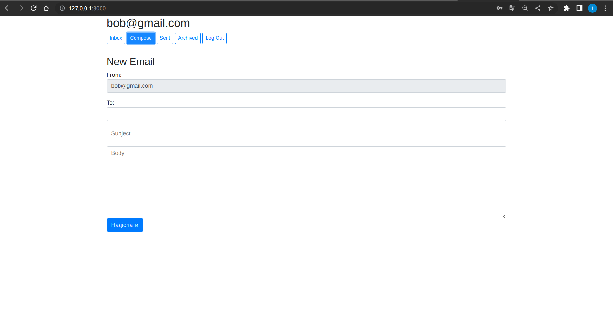
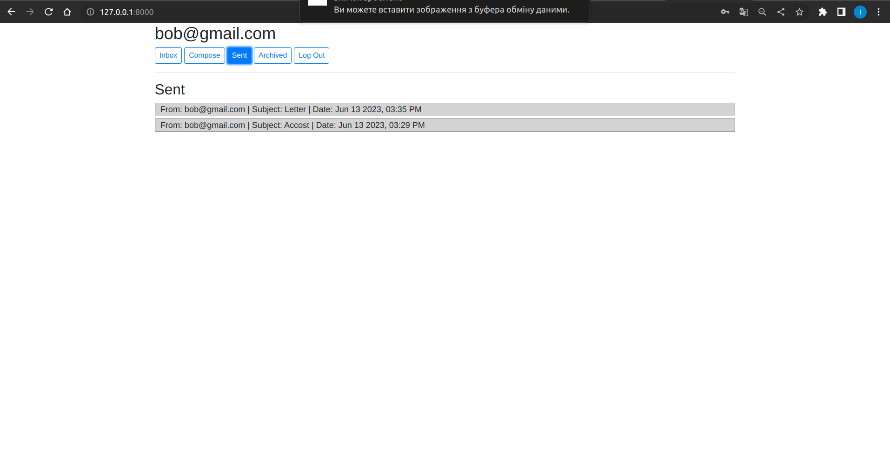
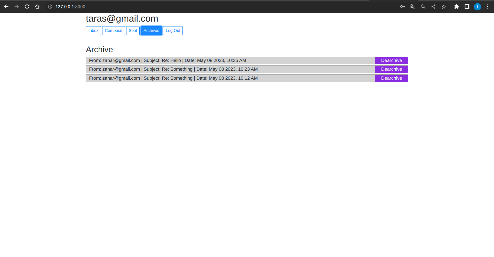
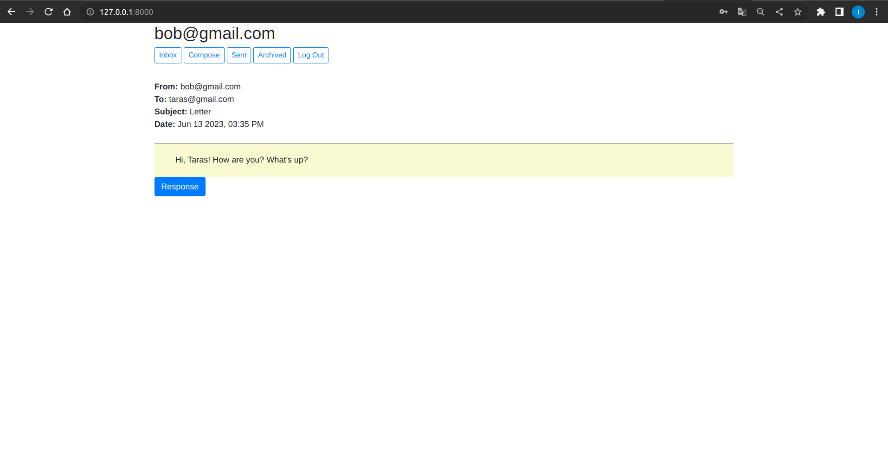

# mail
The email project is a mail client that uses an API to send and receive emails. (The solution to the fourth practical task of the course "Web programming with Python and JavaScript CS50")

